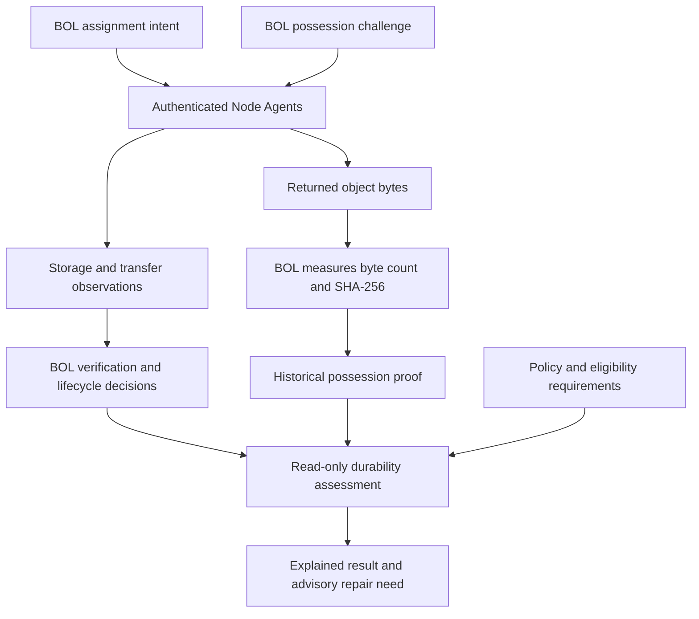

<h1 align="center">BOL — The infrastructure is the network.</h1>

A distributed infrastructure project building verifiable storage across independent machines—with CDN, compute and AI infrastructure as the longer-term vision.

  <a href="#how-bol-works">How it works</a> ·
  <a href="docs/dev_journal/2026-09-20_phase14_durability_possession_assurance.md">Latest engineering journal</a> ·
  <a href="#roadmap">Roadmap</a> ·
  <a href="#get-involved">Get involved</a> ·
  <a href="LICENSE">MIT License</a>

> **Nodes report evidence. BOL derives authoritative state.**

**STORE → DISTRIBUTE → VERIFY → PROVE → RECOVER**

**Implemented and certified:** storage/replica workflows, deterministic verification and bounded possession challenges. **RECOVER: future orchestration—not a completed Phase 14 capability.**

Successful challenges remain historical proof while possession freshness policy is unconfigured. Automated renewal and repair remain future work.

  

## Why BOL?

Independent machines can contribute storage. Coordinating them requires more than recording where copies are supposed to exist.

BOL separates placement intent, completed transfers, reported evidence and authoritative verification. Its control plane asks two different questions:

- **Desired durability:** how many qualifying copies does policy require?
- **Provable durability:** which copies does the available evidence actually support?

A replica record alone does not prove possession. BOL explains its durability conclusions through evidence, qualification rules and exclusion reasons.

Storage is the current engineering focus. The broader goal is a network that can eventually support content delivery, distributed compute and AI workloads.

## What works today?

**Current milestone: Phase 14 — Authoritative Durability & Renewable Possession Assurance.**

| Foundation | Implemented capability |
| --- | --- |
| Authenticated participation | Node identity is established through authentication; nodes do not choose their own authority. |
| Distributed storage workflows | Chunk and replica workflows separate assignment, storage, transfer completion and verification. |
| Replica trust | BOL evaluates evidence and controls deterministic replica lifecycle transitions. |
| Explainable durability | Required copies and qualifying copies are assessed separately, with reasons for exclusions. |
| Physical-copy identity | Stable copy identity survives primary/replica role changes; enrollment does not imply possession. |
| Possession challenges | BOL issues single-use read-back challenges and independently measures returned byte count and SHA-256. |
| Reproducible control plane | An ordered bootstrap constructs the canonical database; startup verifies rather than repairs schema. |

**Important:** successful possession challenges currently remain historical proof. While freshness policy is unconfigured, they contribute **zero sufficiently fresh qualifying copies** to durability assessment. That is a limit on what BOL can currently substantiate, not a declaration that the bytes have been lost.

## How BOL works

| Step | Meaning and status |
| --- | --- |
| **STORE** | Implemented storage workflows handle bytes within the authorized storage boundary. |
| **DISTRIBUTE** | Implemented replica workflows carry out BOL-authorized assignments. |
| **VERIFY** | Implemented deterministic checks evaluate evidence and preserve lifecycle authority. |
| **PROVE** | Implemented bounded challenges establish that an authenticated endpoint supplied the expected bytes during the challenge window. |
| **RECOVER** | Future orchestration. Phase 14 assessment can identify an advisory need for repair, but does not perform it. |

The implemented steps are documented in the [Phase 13](docs/dev_journal/2026-09-19_phase13_verified_replication_trust.md) and [Phase 14](docs/dev_journal/2026-09-20_phase14_durability_possession_assurance.md) journals. “PROVE” does not mean continuous storage has been established.

Historical proof becomes a qualifying input only when all applicable requirements are satisfied. Possession freshness is not yet configured.

### Evidence has boundaries

Primary and replica copies use equivalent possession-proof semantics. Neither a primary label nor a legacy replica status receives a shortcut.

Contradictory evidence remains visible. Earlier proof cannot erase a later contradiction; reconciliation requires qualifying subsequent challenge evidence.

BOL preserves the distinction between:

- what a node reports;
- what BOL verifies;
- what lifecycle actions BOL authorizes;
- and what durability policy can conclude.

AI may advise, but it does not mutate authoritative BOL state.

[Explore the architecture](docs/architecture.md) · [Read the replica-trust journal](docs/dev_journal/2026-09-19_phase13_verified_replication_trust.md)

## Engineering evidence

The September 20, 2026 Phase 14 checkpoint recorded:

| Certification result | Count |
| --- | ---: |
| Passing tests | 226 |
| PostgreSQL integration tests, included above | 126 |
| Python modules compiled | 87 |

Certification covered reproducible empty-database construction, migration replay and upgrade, startup verification, adversarial evidence, credential behavior, concurrency, cancellation and privacy boundaries.

Atomic operations own their database transactions. Storage protections remain in effect through protected filesystem work. Enrolled objects cannot bypass possession assurance through legacy mutation or standalone legacy integrity verification.

These are checkpoint results, not a throughput benchmark, independent security audit or availability guarantee.

This repository presents BOL's public foundation and engineering journals. The journals document milestone capability; they are not a claim that every described capability is available as a turnkey deployment from this checkout.

[Read the complete Phase 14 engineering journal](docs/dev_journal/2026-09-20_phase14_durability_possession_assurance.md)

## Current limits

- **Freshness:** possession-proof lifetime remains unconfigured. Historical proof is not indefinitely current assurance.
- **Renewal:** automated challenge scheduling is not complete.
- **Repair:** Phase 14 does not provide automatic repair, re-replication or surplus deletion.
- **Scope:** authoritative file-level durability remains future work.
- **Independence:** device, operator and geographic guarantees are not established by distinct-node counting.
- **Proof strength:** a successful challenge does not establish local-disk residency, continuous storage or inability to retrieve bytes from another source.

## Explore the network vision

**Concept simulation—not a live or certified network.** Statistics are simulated, and depicted failover behavior illustrates the intended architecture rather than delivered Phase 14 automatic repair.

[Open the interactive concept visualization](https://bol-network-visualizer.asirpal11.chatgpt.site)

**Next public visual asset:** a sanitized possession-challenge demonstration showing BOL's byte measurement, historical proof and the unconfigured freshness limit. This is the highest-priority planned visual; it has not been created yet.

## Roadmap

| Stage | Status | Focus |
| --- | --- | --- |
| Phase 11 — Replica Trust | Complete | Assignment intent, evidence, verification and lifecycle boundaries. |
| Phase 12 — Node Agent Storage Protocol | Implemented and validated | Authenticated storage workflows and transfer-to-verification integration. |
| Phase 13 — Verified Replication Trust | Complete | End-to-end replica trust and retry-safe observation identity. |
| Phase 14A–14B — Durability & Possession Assurance | Implemented and certified | Explainable durability, stable copy identity and authenticated read-back challenges. |
| Phase 14C — Renewal Measurement & Freshness Policy | Next | Measure capacity, latency and failures before selecting a proof lifetime or renewal interval. |
| Later orchestration | Future work | Automated renewal and repair/re-replication, subject to separate design and certification. |

### The broader direction

**Storage → CDN → Compute → AI**

Storage is today's foundation. Content delivery, edge infrastructure, distributed compute, AI inference and broader AI infrastructure remain longer-term goals.

BOL explores voluntary participation by independent operators using existing hardware. Future concepts include a dedicated BOL Node OS, purpose-built devices and compensation for verified contributions. These are vision items, not current product or earnings promises.

Distribution, resilience, security, simplicity and participation guide that work.

## Follow the engineering

- [Phase 14 — Durability & Possession Assurance](docs/dev_journal/2026-09-20_phase14_durability_possession_assurance.md)
- [Phase 13 — Verified Replication Trust](docs/dev_journal/2026-09-19_phase13_verified_replication_trust.md)
- [Phase 12 — Replica Verification](docs/dev_journal/2026-09-19_phase12_replica_verification_complete.md)
- [Phase 12 — Node Agent Storage Protocol](docs/dev_journal/2026-09-18_phase12_node_agent_storage_protocol.md)
- [Phase 11 — Replica Trust](docs/dev_journal/2026-09-11_phase11_replica_trust.md)
- [All development journals](docs/dev_journal/)
- [Architecture](docs/architecture.md)

Whitepaper: in development.

## Get involved

**⭐ Star BOL to support the project and help others discover it.**

- Follow the development journals and choose your preferred GitHub notification settings.
- Explore the architecture and raise focused questions through [GitHub Issues](https://github.com/adityasirpal/BOL/issues).
- Suggest documentation improvements or discuss the scope of a proposed contribution before starting substantial work.

## Founder and license

**Aditya Sirpal — Founder & CEO**

Building the Future of Internet.

BOL's public repository is licensed under the [MIT License](LICENSE).

> The Internet connected people.
>
> Cloud computing connected applications.
>
> BOL explores connecting infrastructure itself.
