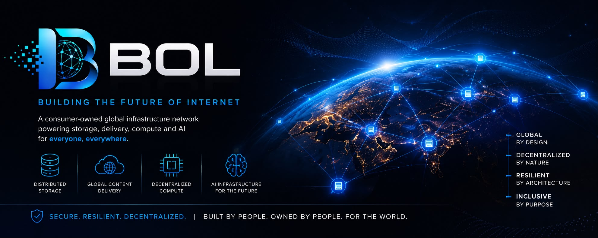

files are coming when i say done only then give responses 

  

<h1 align="center">Building the Future of Internet</h1>

A consumer-owned global infrastructure network designed to power the next generation of storage, content delivery, distributed compute, and artificial intelligence.

---

# The Infrastructure Challenge

Humanity is entering an era unlike anything before.

Artificial intelligence, scientific research, cloud computing, autonomous systems, enterprise applications, streaming, gaming, and billions of connected devices are generating data at an unprecedented pace.

The world is no longer facing a shortage of ideas.

It is facing a growing demand for infrastructure.

For decades, expanding digital infrastructure has largely meant building larger data centers.

That approach has transformed the world.

It has also required enormous investments in land, power, cooling, networking, specialized hardware, regulatory approvals, and continuous capital.

As AI accelerates, the demand for storage, networking, and compute will continue growing.

The question is no longer whether more infrastructure is needed.

The question is:

> **Can humanity build infrastructure differently?**

---

# Introducing BOL

BOL explores a different model.

Instead of relying exclusively on centralized facilities, BOL is designed as a globally distributed infrastructure network powered by independent participants around the world.

Every new participant contributes capacity.

Every new node strengthens resilience.

Every new region improves global availability.

Rather than building one more data center, BOL explores how millions of independently operated systems can work together as one coordinated infrastructure platform.

The objective is not simply distributed storage.

The objective is distributed infrastructure.

---

# Storage Is Only the Beginning

Storage is the foundation.

It is not the destination.

The long-term vision for BOL extends far beyond storing files.

As the platform evolves, BOL aims to support:

- Distributed Storage
- Global Content Delivery
- Intelligent Replication
- Disaster Recovery
- Edge Infrastructure
- Distributed Compute
- AI Inference
- Future AI Infrastructure

Every generation of the platform expands what the network is capable of delivering.

---

# Human-Powered Infrastructure

People already own enormous amounts of infrastructure.

Storage.

Bandwidth.

Processing power.

Most of it remains unused for much of its lifetime.

BOL explores how these resources can become part of a coordinated global network.

Participation is voluntary.

Contribution is measurable.

Growth becomes organic.

Instead of requiring every expansion to begin with constructing another facility, the network grows because people choose to participate.

---

# The Evolution of BOL

The first generation of BOL is designed to operate on existing hardware.

Over time, the platform is expected to evolve into a complete infrastructure ecosystem.

Future milestones include:

### BOL Node OS

A dedicated operating system designed specifically for running BOL infrastructure nodes.

Long-term objectives include:

- Secure boot
- Automatic updates
- Remote management
- Minimal operating environment
- Optimized networking
- Simplified deployment

### Dedicated BOL Node Devices

As the platform matures, BOL envisions purpose-built hardware designed specifically for the network.

These dedicated devices are intended to provide:

- Plug-and-play deployment
- Enterprise-grade reliability
- Optimized storage performance
- Low power consumption
- Secure hardware architecture
- Simplified participation

The long-term objective is simple:

Connect power.

Connect Internet.

Become part of the global infrastructure network.

---

# A Global Participation Economy

Infrastructure should not only be consumed.

It should also be possible to contribute to it.

BOL envisions a future where operators who provide verified infrastructure resources can receive compensation based on measurable network contribution.

Future settlement mechanisms may include digital payment networks such as USDC or other stable digital assets, subject to legal, regulatory, and technical considerations.

---

# Built for the AI Era

Artificial intelligence will require dramatically more infrastructure than exists today.

Training models.

Serving models.

Managing datasets.

Distributing knowledge.

Operating globally.

The next generation of AI will depend not only on better models, but on significantly expanding the world's storage, networking, and compute capacity.

BOL aims to become one of the infrastructure platforms capable of supporting that future.

---

# Current Development

This repository represents the public foundation of the BOL platform.

Current capabilities include:

- Distributed node registration
- Metadata management
- Chunk-based storage
- Automatic replication
- Integrity validation
- Recovery workflows
- Encryption
- PostgreSQL integration
- Modular architecture

These are the building blocks of a much larger vision.

---

# Core Principles

Everything within BOL is guided by a few fundamental principles.

## Distribution

Infrastructure should become stronger as participation grows.

## Resilience

No individual node should become a single point of failure.

## Security

Encryption, integrity verification, and trust should be built into the foundation.

## Simplicity

Powerful infrastructure should remain simple to deploy and operate.

## Participation

The Internet connected computers.

BOL explores what happens when infrastructure itself becomes connected.

---

# Open Development

BOL is being developed in public because resilient infrastructure benefits from transparency, collaboration, and continuous improvement.

The public repository represents the open foundation of the platform.

Architecture, engineering milestones, and documentation will continue evolving alongside the network itself.

---

# Documentation

- Architecture → `docs/architecture.md`
- Roadmap → Coming Soon
- Whitepaper → In Development

---

# Founder

**Aditya Sirpal**

Founder & CEO

Building the Future of Internet.

---

> *The Internet connected people.*
>
> *Cloud computing connected applications.*
>
> *BOL explores connecting infrastructure itself.*
