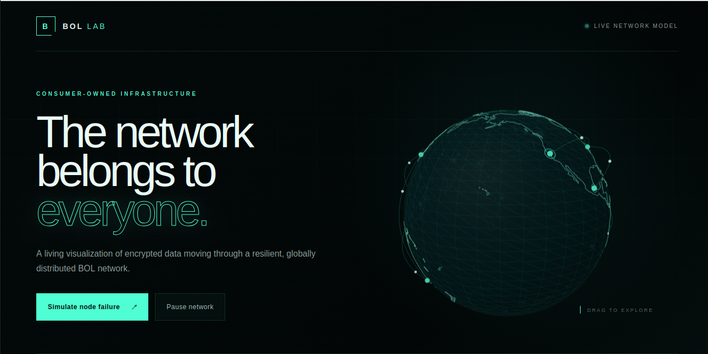

  

<h1 align="center">Building the Future of Internet</h1>

A consumer-owned global infrastructure network designed to power the next generation of storage, content delivery, distributed compute, and artificial intelligence.

---

---

## Experience the BOL Network

  <a href="https://bol-network-visualizer.asirpal11.chatgpt.site">
    <strong>🌐 Launch Interactive Network Visualization</strong>
  </a>

> **Concept visualization:** Network statistics are simulated and demonstrate BOL’s intended architecture and automatic failover behavior.

---

# The Infrastructure Challenge

Humanity is entering an era unlike anything before. Artificial intelligence, scientific research, cloud computing, autonomous systems, enterprise applications, streaming, gaming, and billions of connected devices are generating data at an unprecedented pace. The world is no longer facing a shortage of ideas. It is facing a growing demand for infrastructure. 
For decades, expanding digital infrastructure has largely meant building larger data centers. That approach has transformed the world. It has also required enormous investments in land, power, cooling, networking, specialized hardware, regulatory approvals, and continuous capital. As AI accelerates, the demand for storage, networking, and compute will continue growing. The question is no longer whether more infrastructure is needed. The question is:

> **Can humanity build infrastructure differently?**

---

# Introducing BOL

BOL explores a different model. Instead of relying exclusively on centralized facilities, BOL is designed as a globally distributed infrastructure network powered by independent participants around the world. Every new participant contributes capacity. Every new node strengthens resilience. Every new region improves global availability. Rather than building one more data center, BOL explores how millions of independently operated systems can work together as one coordinated infrastructure platform. The objective is not simply distributed storage. The objective is distributed infrastructure.

---

# Storage Is Only the Beginning

Storage is the foundation. It is not the destination. The long-term vision for BOL extends far beyond storing files. As the platform evolves, BOL aims to support:

1. Distributed Storage
2. Global Content Delivery
3. Intelligent Replication
4. Disaster Recovery
5. Edge Infrastructure
6. Distributed Compute
7. AI Inference
8. Future AI Infrastructure

Every generation of the platform expands what the network is capable of delivering.

---

# Human-Powered Infrastructure

People already own enormous amounts of infrastructure, Storage, Bandwidth, Processing power. Most of it remains unused for much of its lifetime. BOL explores how these resources can become part of a coordinated global network. Participation is voluntary. Contribution is measurable. Growth becomes organic. Instead of requiring every expansion to begin with constructing another facility, the network grows because people choose to participate.

---

# The Evolution of BOL

The first generation of BOL is designed to operate on existing hardware. Over time, the platform is expected to evolve into a complete infrastructure ecosystem. Future milestones include:

### BOL Node OS

A dedicated operating system designed specifically for running BOL infrastructure nodes. Long-term objectives include:

1. Secure boot
2. Automatic updates
3. Remote management
4. Minimal operating environment
5. Optimized networking
6. Simplified deployment

### Dedicated BOL Node Devices

As the platform matures, BOL envisions purpose-built hardware designed specifically for the network. These dedicated devices are intended to provide:

1. Plug-and-play deployment
2. Enterprise-grade reliability
3. Optimized storage performance
4. Low power consumption
5. Secure hardware architecture
6. Simplified participation

The long-term objective is simple: Connect power, Connect Internet - Become part of the global infrastructure network.

---

# A Global Participation Economy

Infrastructure should not only be consumed. It should also be possible to contribute to it. BOL envisions a future where operators who provide verified infrastructure resources can receive compensation based on measurable network contribution. Future settlement mechanisms may include digital payment networks such as USDC or other stable digital assets, subject to legal, regulatory, and technical considerations.

---

# Built for the AI Era

Artificial intelligence will require dramatically more infrastructure than exists today. Training models, Serving models, Managing datasets, Distributing knowledge, Operating globally. The next generation of AI will depend not only on better models, but on significantly expanding the world's storage, networking, and compute capacity. BOL aims to become one of the infrastructure platforms capable of supporting that future.

---

# Current Development

**Current milestone: Phase 12A–12E — Node Agent Storage Protocol.** The [September 18, 2026 development journal](docs/dev_journal/2026-09-18_phase12_node_agent_storage_protocol.md) documents implementation and validation of the core protocol boundaries from assignment delivery through authenticated transfer completion. Phase 11 replica trust is complete; further integration of transfer completion with evidence and verification remains ahead.

This repository presents BOL's public foundation and sanitized engineering progress. Earlier prototype work established node registration, metadata management, chunk-based storage, replication, integrity validation, and recovery workflows. Current development strengthens how storage work is authorized, performed, and evaluated.

## Phase 11 — Replica Trust Foundation

Phase 11 established a clear separation between four responsibilities:

1. **Assignment intent:** BOL defines the replica it expects to be created.
2. **Node observation:** An authenticated node reports what it observed.
3. **BOL verification:** Deterministic checks evaluate evidence against authoritative expectations.
4. **Assignment lifecycle:** A separate control-plane decision authorizes legal state transitions.

The governing principle remains:

> **Nodes report evidence; BOL derives authoritative state.**

Phase 11 completed adversarial testing and end-to-end validation of this trust chain. Historical replica records were not automatically converted into verified copies. See the [Phase 11 journal](docs/dev_journal/2026-09-11_phase11_replica_trust.md).

## Phase 12A–12E — From Assignment to Transfer Completion

The latest journal documents five implemented protocol boundaries:

| Milestone | Public outcome |
| --- | --- |
| 12A — Assignment delivery | An authenticated destination receives only the assignments addressed to it. Retrieval does not advance assignment state. |
| 12B — Assignment acceptance | The destination explicitly accepts work; BOL controls the legal transition and enforces assignment expiry. Repeated acceptance is handled safely. |
| 12C — Durable replica storage | The Node Agent controls locations within its storage boundary, handles partial writes, checks locally stored bytes, and safely finalizes valid objects. |
| 12D — Assignment-bound authority | Storage uses BOL's authoritative assignment expectations. The caller cannot choose its own destination, integrity expectations, or lifecycle state. |
| 12E — Transfer completion | The authenticated destination reports completion observations. BOL checks ownership, lifecycle, expiry, timing, and integrity before accepting the transfer-stage transition. |

Validation covered destination isolation, expired and invalid assignments, storage containment, partial writes, integrity mismatches, conflicting stored content, corruption handling, and safe retries. Rejected operations were also checked to ensure they do not silently advance authoritative state.

## Transferred Does Not Mean Verified

Accepted transfer completion means that a destination's completion observation passed the transfer-stage checks. Verified replica possession remains a separate decision based on evidence and deterministic BOL verification.

This distinction keeps local storage success, node reports, and authoritative replica trust separate. It provides the foundation for future durability and recovery decisions.

---

# Roadmap

| Milestone | Status | Focus |
| --- | --- | --- |
| Phase 11 — Replica Trust Architecture | Complete | Assignment intent, node evidence, deterministic verification, and legal lifecycle transitions. |
| Phase 12A–12E — Node Agent Storage Protocol | Implemented and validated in the September 18 journal | Authenticated assignment delivery, acceptance, durable storage, assignment-bound authority, and transfer completion. |
| Transfer-to-verification integration | Next development work | Connect the transfer lifecycle with the existing replica evidence and deterministic verification architecture. |

The current milestone covers the core transfer protocol boundaries. Further integration and validation remain before treating the full replication path as verified end to end.

BOL's broader vision remains distributed storage, content delivery, distributed compute, and AI infrastructure. Follow the [public development journals](docs/dev_journal/) for milestone updates.

---

# Core Principles

Everything within BOL is guided by a few fundamental principles.

## Distribution

Infrastructure should become stronger as participation grows.

## Resilience

No individual node should become a single point of failure.

## Security

Encryption, integrity verification, and trust should be built into the foundation.

## Simplicity

Powerful infrastructure should remain simple to deploy and operate.

## Participation

The Internet connected computers. BOL explores what happens when infrastructure itself becomes connected.

---

# Open Development

BOL is being developed in public because resilient infrastructure benefits from transparency, collaboration, and continuous improvement. The public repository represents the open foundation of the platform. Architecture, engineering milestones, and documentation will continue evolving alongside the network itself.

---

# Documentation

- [Architecture](docs/architecture.md)
- [Roadmap](#roadmap)
- [Development journals](docs/dev_journal/)
- [Phase 11 — Replica Trust](docs/dev_journal/2026-09-11_phase11_replica_trust.md)
- [Phase 12A–12E — Node Agent Storage Protocol](docs/dev_journal/2026-09-18_phase12_node_agent_storage_protocol.md)
- Whitepaper → In Development

---

# Founder

**Aditya Sirpal**

Founder & CEO

Building the Future of Internet.

---

> *The Internet connected people.*
>
> *Cloud computing connected applications.*
>
> *BOL explores connecting infrastructure itself.*
